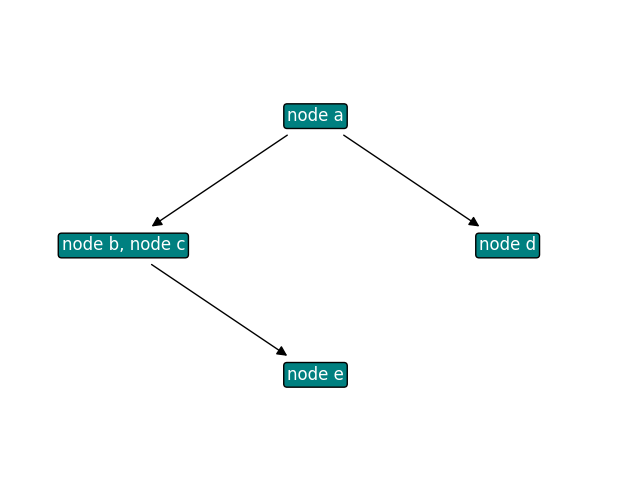

# Hasse Diagram

This small package helps with plotting Hasse Diagrams and is very useful when presenting results for the MCDA methods.

## Installation

```
pip install hasse-diagram
```

## Example usage
```python
import numpy as np
from hassediagram import plot_hasse

data = np.array([
    [0, 1, 1, 1, 1],
    [0, 0, 1, 0, 1],
    [0, 1, 0, 0, 1],
    [0, 0, 0, 0, 0],
    [0, 0, 0, 0, 0]
])
labels = ["node a", "node b", "node c", "node d", "node e"]
plot_hasse(data, labels)
```

Result:



You can optionally turn off the transitive reduction and change the color of nodes and edges.

## Testing
```
pytest --cov=src --cov-report=term-missing
```

This package is inspired by a similar one for R: [hasseDiagram](https://github.com/kciomek/hasseDiagram)